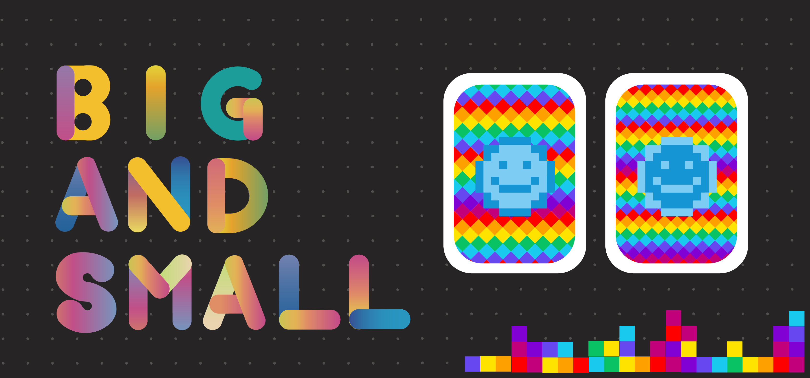

<p align=center>

</p>

> Non-fungible token game

This project is a crypto card game that uses [OpenZepplin](https://github.com/OpenZeppelin/openzeppelin-solidity).

The contract is compiled and deployed under the ERC-721 non-fungible token standard with truffle framework. After deploying onto the Ethereum blockchain, users will be able to play the game by interacting with the smart contract through DAPP’s front-end interface.

Acquiring game card:
Users can acquire game cards using ETH. Every game card will have a game point on it, which will be used to determine the winner later in the game.

## Roles

#### Card Collection
Players can aquire card using ether. Each card will have a random points on it, which will be used to deternmine the winner in the card game.

#### Card Battle
Once entered the game, players will need to choose a card to play for the round. Each round, the smart contract will randomly decide either card with larger or smaller point wins the round. At the same time, the smart contract will also randomly generate a number in order to compete with the player. Winner of the game will receive the price.

#### Dashboard
You can view the card battle history about all the games you played.

## ERC-721 Token

ERC-721 non-fungible token:
    ERC-721 is a free, open standard that describes how to build non-fungible or unique tokens on the Ethereum blockchain. While most tokens are fungible (every token is the same as every other token), ERC-721 tokens are all unique (with unique ID).

[Reference](https://github.com/ethereum/EIPs/blob/master/EIPS/eip-721.md)


## Contracts
You can find contract detail under `contracts/` directory:
- [`CryptoHerosGame.sol`](./contracts/CryptoHerosGame.sol):
    The implementation of game execution and rule.

- [`CryptoHerosToken.sol`](./contracts/CryptoHerosToken.sol):
    The implementation of game cards purchase and generation.

## Technical stack

### Frontend
- React
- Redux
- Saga

### UI
- Sass
- Material-UI

### Smart contract/Solidity
- Truffle

## Requirements

* NodeJS 8.0+ recommended.
* Windows, Linux or Mac OS X.

## How To Install Dependencies

Install truffle:

```
npm install -g truffle
```

Then install contract dependencies:

```
npm install
```

## How To Deploy

Now you can compile and deploy contracts:

```
truffle compile && truffle migrate --network prod
```

## Playground

We already deployed contracts to [Findora](http://dev-evm.findorascan.io.s3-website-us-west-2.amazonaws.com/) network. You can play with them RIGHT NOW.

| Contract         | Token address | Transaction hash
|------------------|---------------|---------------------
| CryptoHerosGame  | [0x1c6B02980E668d655802840b39e25ae1C3b5B668](http://dev-evm.findorascan.io.s3-website-us-west-2.amazonaws.com/addressevm?key=0x1c6B02980E668d655802840b39e25ae1C3b5B668) | [0x9dd3a99d6ffa05db2dd5b4934009e0148154dd96d9f477c313d92a443f9ee94c](http://dev-evm.findorascan.io.s3-website-us-west-2.amazonaws.com/tx/0x9dd3a99d6ffa05db2dd5b4934009e0148154dd96d9f477c313d92a443f9ee94c)
| CryptoHerosToken | [0x9387327F57668B8088C167d454cBC4AaC7268337](http://dev-evm.findorascan.io.s3-website-us-west-2.amazonaws.com/addressevm?key=0x9387327F57668B8088C167d454cBC4AaC7268337) | [0xab2ed7bada8fe29ba4c7c154eca8668c7e5ee8f6dbe10b2aa7d55df0c763cc45](http://dev-evm.findorascan.io.s3-website-us-west-2.amazonaws.com/tx/0xab2ed7bada8fe29ba4c7c154eca8668c7e5ee8f6dbe10b2aa7d55df0c763cc45)

## Card List

See [CARD.md](./dapp/CARD.md) for more information.

## Licence

See [LICENSE](./LICENSE) for details.
